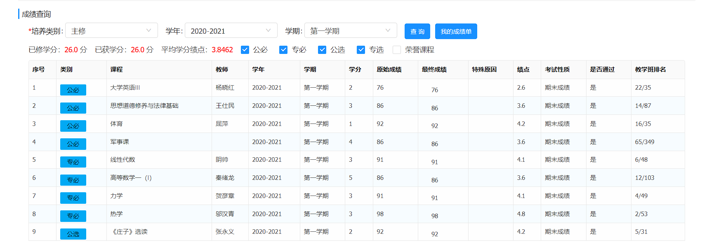

# 为 SYSU-Phys-Bench 贡献数据

感谢你帮助扩展中山大学物理学院本科课程数据集。每一份合格投稿都会增加课程覆盖、提供新的独立观测，并改善课程级 Yu Index 的统计稳定性。

## 可以贡献什么

仓库接受以下贡献：

1. **课程数据**：中山大学物理学院本科生本人的课程成绩、绩点与教学班排名；
2. **数据修正**：课程名称、类别、学分、教师或已有记录中的明确错误；
3. **方法与代码**：Yu Index、统计汇总、数据校验、可视化和前端交互；
4. **文档**：数据字典、技术报告、贡献流程和使用说明。

课程数据请通过 Pull Request 投稿。每位贡献者使用一个独立 CSV 文件，仓库会自动校验格式、数值范围、记录 ID 与生成结果。

## 投稿前确认

- 只提交你本人的成绩数据，或你已获得数据所有者明确授权的数据；
- 删除姓名、学号、联系方式、证件号码和成绩单文件中的其他个人身份信息；
- 使用稳定的匿名 `contributor_id`，无需在 CSV 中填写真实姓名；
- 确认成绩、绩点、教学班名次和教学班人数均来自正式成绩记录；
- 了解 Pull Request、提交记录及其历史版本是公开的。

教师字段是可选字段。原始 Excel、PDF、截图或教务系统导出文件不应加入仓库。

## 从教务系统获取成绩

### 1. 查询一个学期

1. 打开[中山大学教务系统](https://jwxt.sysu.edu.cn/)，使用 NetID 登录；已毕业学生也可以登录；
2. 点击“我的成绩”，进入“成绩查询”；
3. 选择培养类别、学年和学期，勾选需要查询的课程类别；
4. 点击“查询”。系统一次只能查询一个学期，因此需要逐学期操作。



### 2. 复制成绩表格

从表格第一条课程开始，框选到最后一条课程的“教学班排名”，然后复制。复制内容会包含课程、教师、学年、学期、学分、最终成绩、绩点和教学班排名。教师为空的课程也可以正常转换。

不需要手工整理制表符或换行。转换脚本会识别教务系统复制文本中的断行和空白字段。

### 3. 一键转换当前剪贴板

先按下方数据投稿流程 Fork 并克隆仓库，再确定一个匿名 `contributor_id`，例如 `phys-2023-a7`。在仓库目录运行：

```powershell
python scripts/convert_sysu_clipboard.py `
  --clipboard `
  --contributor-id phys-2023-a7 `
  --cohort 2023 `
  --program 物理学
```

脚本会自动：

- 读取当前剪贴板；
- 识别教务系统表格行和缺失教师；
- 将 `22/35` 拆分为教学班名次与人数；
- 根据入学年份、学年和学期生成“大一/大二”和 `2020-fall` 一类字段；
- 生成稳定且匿名的 `record_id`；
- 创建或合并到 `data/submissions/phys-2023-a7.csv`。

查询并复制下一个学期后，重复运行同一条命令。已经导入过的相同课程会自动跳过，因此可以放心重跑。

### 4. 使用文本文件批量转换

如果系统无法读取剪贴板，可以将每学期复制的内容分别保存为 UTF-8 文本文件。建议放在仓库的 `local-import/` 目录；该目录已被 Git 忽略，不会进入 Pull Request。

```powershell
python scripts/convert_sysu_clipboard.py `
  local-import/2020-fall.txt `
  local-import/2021-spring.txt `
  --contributor-id phys-2023-a7 `
  --cohort 2023 `
  --program 物理学
```

转换完成后，打开生成的 CSV，抽查课程、最终成绩、绩点和教学班排名。不要提交 `local-import/` 中的原始复制文本。

## 数据投稿流程

### 1. Fork 并创建分支

```bash
git clone https://github.com/<你的 GitHub 用户名>/SYSU-Phys-Bench.git
cd SYSU-Phys-Bench
git checkout -b data/<你的 contributor_id>
```

### 2. 生成或创建投稿文件

推荐使用上面的教务系统转换脚本。它会直接生成符合字段顺序的投稿 CSV。

如需手工填写，也可以复制模板，并将文件名改成你的 `contributor_id`：

```powershell
Copy-Item data/submissions/template.csv data/submissions/<contributor_id>.csv
```

`contributor_id` 只能包含小写字母、数字、连字符和下划线，长度为 3—32 位。例如：`phys-2023-a7`。

每个 `record_id` 必须全局唯一，并以 `<contributor_id>-` 开头，例如：`phys-2023-a7-001`。

### 3. 检查课程记录

CSV 必须使用 UTF-8 编码，表头顺序不得更改。字段定义如下：

| 字段 | 必填 | 格式 | 说明 |
|---|---:|---|---|
| `record_id` | 是 | 小写标识符 | 单条记录的永久 ID |
| `contributor_id` | 是 | 小写标识符 | 匿名贡献者 ID，与文件名一致 |
| `cohort` | 是 | 四位年份 | 入学年份，如 `2023` |
| `program` | 是 | 文本 | 专业或培养方向，如 `物理学` |
| `course_name` | 是 | 文本 | 教务系统中的正式课程名 |
| `teacher` | 否 | 文本 | 多位教师使用英文逗号分隔 |
| `category` | 是 | 枚举 | `公必`、`专必`、`公选`、`专选`、`荣誉课程` 或 `其他` |
| `academic_year` | 是 | 枚举 | `大一`、`大二`、`大三`、`大四` 或 `其他` |
| `semester` | 是 | 枚举 | `第一学期`、`第二学期`、`暑期` 或 `其他` |
| `term_id` | 是 | 学期标识 | `YYYY-fall`、`YYYY-spring`、`YYYY-summer` 或 `YYYY-other`，后缀须与学期一致 |
| `credits` | 是 | 0.1—20 | 课程学分 |
| `final_grade` | 否 | 文本或数值 | 最终成绩，可填写 `优秀`、`良好` 等等级成绩 |
| `grade_point` | 是 | 0—5 | 课程绩点 |
| `class_rank` | 是 | 正整数 | 教学班名次，第 1 名为最高 |
| `class_size` | 是 | ≥2 的整数 | 教学班总人数 |

每门课程应占一行。不要合并课程，也不要预先计算 Yu Index。无论使用自动转换还是手工填写，都应在提交前抽查生成结果。

### 4. 本地校验并生成网页数据

校验全部投稿：

```powershell
python scripts/validate_submissions.py
```

生成网页使用的社区数据：

```powershell
python scripts/build_dataset.py
```

再次确认生成文件已经同步：

```powershell
python scripts/build_dataset.py --check
```

提交 CSV、更新后的 `community-data.js` 与 README 徽章统计：

```bash
git add data/submissions/<contributor_id>.csv community-data.js assets/readme/dataset-stats.json
git commit -m "data: add <contributor_id> course records"
git push -u origin data/<contributor_id>
```

### 5. 创建 Pull Request

Pull Request 模板会要求确认数据权属、匿名化、校验结果和公开授权。维护者会检查：

- 自动校验是否通过；
- CSV 是否符合数据字典；
- 记录是否属于项目收录范围；
- 数据与生成文件是否同步；
- 是否存在明显重复、异常或身份信息。

合并后，数据会进入下一次 SYSU-Phys-Bench 网站更新。

## 多样本 Yu Index

单条课程记录先按技术报告中的公式计算观测级 Yu Index：

$$
Y_i=G_i-\frac{1}{3}\Phi^{-1}\!\left(\frac{n_i-r_i+\frac{5}{8}}{n_i+\frac{1}{4}}\right).
$$

同一课程有 $m_c$ 条有效记录时，课程级基准值取算术平均：

$$
\bar{Y}_c=\frac{1}{m_c}\sum_{i=1}^{m_c}Y_i.
$$

网页会同时显示样本数与贡献者数量。课程筛选、学年筛选和学期筛选先作用于观测记录，再计算当前视图中的课程汇总值。

## 代码与文档贡献

代码或文档 PR 请保持改动聚焦，并在说明中写明：

- 改动解决的问题；
- 用户可见的变化；
- 已执行的检查；
- 涉及数据或方法定义时，对结果可比性的影响。

修改 `app.js` 后至少运行：

```powershell
node --check app.js
```

修改投稿格式或构建脚本后，必须同时更新 `data/README.md`、模板、校验器和贡献指南。README 中的结果图由维护者在发布数据集快照时更新。

## 数据修正与移除

发现数据错误时，请提交修正 PR，并在说明中列出受影响的 `record_id`。如需将自己的数据从当前版本移除，请创建 Issue 或 PR；维护者可以从活跃数据集中删除记录，但 Git 历史和已产生的 Fork 仍可能保留旧版本。
