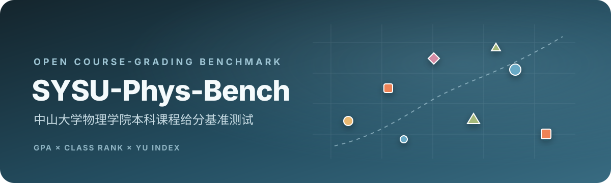
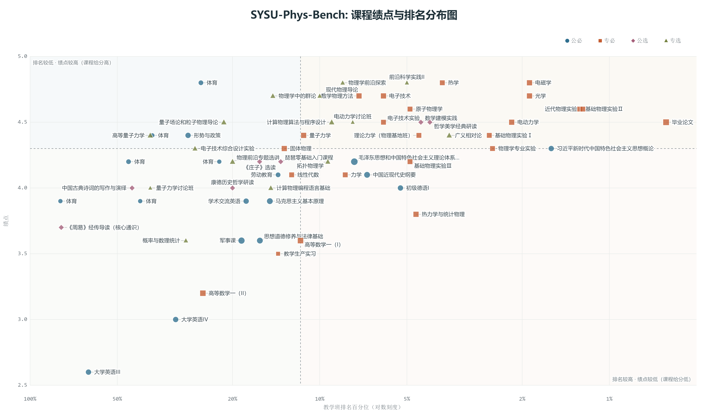
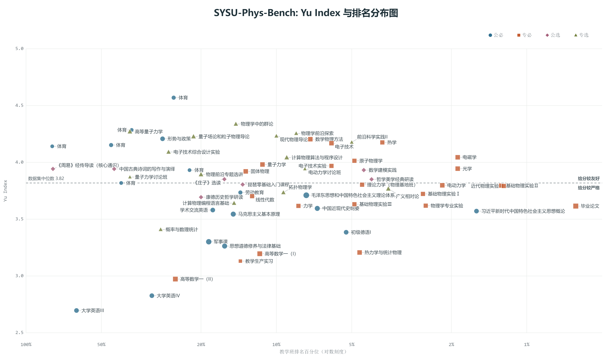

<div align="center">
  

  <h1>SYSU-Phys-Bench</h1>

  <h3>中山大学物理学院本科课程给分基准测试</h3>

  <p><strong>把课程给分，放到同一把尺上。</strong></p>

  <p>
    
    
    
  </p>

  <p>
    <a href="https://www.yykspace.com/show/sysu-phys-bench/">在线测评</a>
    · <a href="#results">当前结果</a>
    · <a href="#benchmark">Benchmark</a>
    · <a href="#yu-index">Yu Index</a>
    · <a href="#open-dataset">开放数据集</a>
    · <a href="CONTRIBUTING.md">贡献指南</a>
    · <a href="https://github.com/YinkaiYu/SYSU-Phys-Bench/actions/workflows/validate-data.yml">数据校验</a>
    · <a href="#citation">引用</a>
  </p>
</div>

<a href="https://www.yykspace.com/show/sysu-phys-bench/">
  
</a>

---

## Overview

**SYSU-Phys-Bench** 是中山大学物理学院本科课程给分基准测试。项目结合课程绩点与教学班排名，通过 Yu Index 估计课程给分友好度，并以交互式图表、完整课程记录和可复现的数据管线公开呈现结果。

项目由余荫铠 2020—2024 年本科成绩数据启动，现已开放接收更多中山大学物理学院学生的数据贡献。随着独立样本增加，benchmark 可以覆盖更多课程，并给出统计上更稳定的课程级 Yu Index。

> [!IMPORTANT]
> **我们正在扩充开放数据集。** 如果你愿意贡献自己的课程成绩、绩点与教学班排名，请阅读 [贡献指南](CONTRIBUTING.md)，通过标准 CSV 和 Pull Request 加入 SYSU-Phys-Bench。

## Benchmark

SYSU-Phys-Bench 将每条课程记录视为一个实验数据点：

| 信号 | 含义 | 网页呈现 |
|---|---|---|
| 课程绩点 $G$ | 学生获得的绝对成绩 | 绩点分布、课程散点、学期趋势 |
| 教学班名次 $r/n$ | 学生在教学班中的相对位置 | 对数排名轴、排名趋势、交互提示 |
| Yu Index $Y$ | 分离个人相对表现后的课程给分水平估计 | 课程给分友好度、课程级聚合 |
| 学分 | 课程权重 | 点尺寸、行层级、加权统计 |
| 课程属性 | 类别、教师、学年与学期 | 多选筛选、搜索和明细表 |

在线 benchmark 提供：

- **课程绩点与排名分布图**：四象限观察课程的成绩与相对排名组合；
- **Yu Index 与排名分布图**：比较课程给分友好度并显示数据集基准线；
- **课程级 / 样本级视图**：既查看每一条原始记录，也查看同名课程的多样本聚合；
- **完整课程明细**：搜索、筛选、排序并保留贡献者与样本信息；
- **数据集统计**：贡献者、记录数、课程覆盖、绩点分布、学分构成和类别统计；
- **全屏与 PNG 导出**：生成适合分享和进一步分析的高分辨率图表；
- **Yu Index 计算器**：使用自己的 $G$、$r$、$n$ 计算单条实验数据点。

## Results

以下为当前公开数据集的两张核心结果图。点击图片可查看原始分辨率；交互筛选、样本提示、全屏查看与 PNG 导出见 [在线 Benchmark](https://www.yykspace.com/show/sysu-phys-bench/)。

### 课程绩点与排名分布

<a href="assets/readme/figures/course-gpa-rank.png">
  
</a>

### Yu Index 与排名分布

<a href="assets/readme/figures/yu-index-rank.png">
  
</a>

## Yu Index

对个人绩点 $G$、教学班名次 $r$ 和教学班人数 $n$，定义：

$$
Y=G-\frac{1}{3}\Phi^{-1}\!\left(\frac{n-r+\frac{5}{8}}{n+\frac{1}{4}}\right),
$$

其中 $\Phi^{-1}$ 是标准正态分布的逆累积分布函数。Yu Index 使用名次估计个人相对表现，再从个人绩点中分离这一部分，得到与 GPA 同尺度的课程给分水平估计。**Yu Index 越高，说明课程给分越友好。**

同一课程有 $m_c$ 条有效记录时，课程级 benchmark 取观测级 Yu Index 的算术平均：

$$
\bar{Y}_c=\frac{1}{m_c}\sum_{i=1}^{m_c}Y_i.
$$

网页会同时报告课程的样本数和独立贡献者数量。公式推导、Blom 位置、参数拟合、相关性检验和计算示例见 [Yu Index 技术报告](https://www.yykspace.com/show/sysu-phys-bench/yu-index.html)。

## Open Dataset

社区数据采用“一位贡献者一个 CSV”的结构。原始投稿经过统一校验后，确定性生成浏览器可直接加载的 `community-data.js`。


```text
data/submissions/*.csv
        │
        ├── python scripts/validate_submissions.py
        └── python scripts/build_dataset.py
                         │
                         └── community-data.js
```

每条记录包括匿名贡献者 ID、入学年份、培养方向、课程、教师、类别、学年、学期、学分、最终成绩、绩点、教学班名次与教学班人数。完整字段定义见 [数据集说明](data/README.md)。

## Contribute Data

贡献一份新数据只需要四步：

1. Fork 本仓库；
2. 在教务系统逐学期复制成绩表，使用转换脚本生成匿名投稿 CSV；
3. 检查课程记录并运行校验与构建；
4. 提交 Pull Request。

将各学期复制内容分别保存到 `local-import/*.txt` 后，一次性转换：

```powershell
python scripts/convert_sysu_grades.py local-import --contributor-id phys-2023-a7 --cohort 2023 --program 物理学
```

```powershell
python scripts/validate_submissions.py
python scripts/build_dataset.py
python scripts/build_dataset.py --check
```

GitHub Actions 会对每个数据 PR 自动执行同样的检查。投稿必须是贡献者本人所有或已获明确授权的数据，并且不得包含姓名、学号、联系方式或原始成绩单文件。

详细流程、字段表、匿名规则、审核标准和数据修正方式见 **[CONTRIBUTING.md](CONTRIBUTING.md)**。

## Reproducibility

网页采用原生 HTML、CSS、JavaScript 与 SVG，无前端框架和构建步骤。克隆后可直接打开 `index.html`，或启动本地静态服务器：

```bash
git clone https://github.com/YinkaiYu/SYSU-Phys-Bench.git
cd SYSU-Phys-Bench
python -m http.server 8000
```

访问 <http://localhost:8000/>。

验证公开数据集：

```bash
python scripts/validate_submissions.py
python scripts/build_dataset.py --check
```

从维护者的原始 Excel 工作簿重新生成首批数据需要 `openpyxl`：

```bash
python -m pip install openpyxl
python scripts/extract_data.py
python scripts/build_dataset.py
```

## Repository Structure

```text
SYSU-Phys-Bench/
├── .github/
│   ├── workflows/validate-data.yml    # 数据 PR 自动校验
│   └── PULL_REQUEST_TEMPLATE.md       # 投稿检查清单
├── assets/
│   ├── brand/logo-mark.svg            # 项目标志
│   ├── docs/jwxt-grade-query.png      # 教务系统操作示意
│   └── readme/                        # 品牌主视觉、动态统计与当前结果图
├── data/
│   ├── README.md                      # 数据集与聚合说明
│   └── submissions/                   # 标准化社区投稿
├── scripts/
│   ├── extract_data.py                # 初始 Excel 数据提取
│   ├── validate_submissions.py        # CSV schema 与数值校验
│   ├── convert_sysu_grades.py         # 教务系统成绩文本转换
│   └── build_dataset.py               # 生成浏览器数据
├── tests/                              # 转换器自动测试
├── index.html                         # Benchmark 主页面
├── yu-index.html                      # Yu Index 技术报告
├── app.js                             # 图表、筛选、聚合与交互
├── styles.css                         # 页面与响应式样式
├── data.js                            # 初始成绩总览
├── community-data.js                  # 社区数据生成文件
├── CONTRIBUTING.md                    # 完整贡献指南
└── CITATION.cff                       # 引用元数据
```

## Roadmap

- [x] 发布 2020—2024 初始课程数据
- [x] 建立 Yu Index 与公开技术报告
- [x] 提供交互式 benchmark、移动端交互与 PNG 导出
- [x] 建立标准投稿格式、自动校验和 PR 工作流
- [x] 支持多贡献者数据集规模统计与课程级聚合
- [ ] 扩充不同年级、培养方向和课程类别的数据覆盖
- [ ] 在样本量允许时加入课程级不确定度与跨学期稳健性分析
- [ ] 发布带版本号的数据集快照

## Citation

仓库提供 [`CITATION.cff`](CITATION.cff)。如果在分析、文章或项目中使用 SYSU-Phys-Bench，可引用本仓库：

```text
Yu, Yin-Kai. SYSU-Phys-Bench: 中山大学物理学院本科课程给分基准测试. 2026.
https://github.com/YinkaiYu/SYSU-Phys-Bench
```

## Maintainer

余荫铠 · [yykspace.com](https://www.yykspace.com/)
